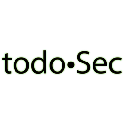

# Home

Hi Team, thank you for visiting. I say _Team_ because we're in this learning journey **together** and, by providing my notes and documenting everything I learn, study and teach on my way to achieve Cisco's CCNP Encor 350-401 and eCPPTv2 \(while I progress through the PTP's techniques and lessons\), I hope others pursuing the same \(i.e [Reddit eLS](https://www.reddit.com/r/eLearnSecurity/) or [Reddit CCNP](https://www.reddit.com/r/ccnp/)\) to find this information useful. 

Later on, I plan on taking on the PWK and sit down for OSCP to appeal to any potential HR departments\). 

I want to help you the way others more experienced and knowledgeable than me have helped and guided me too. Please count on me, we're in this **together**!

