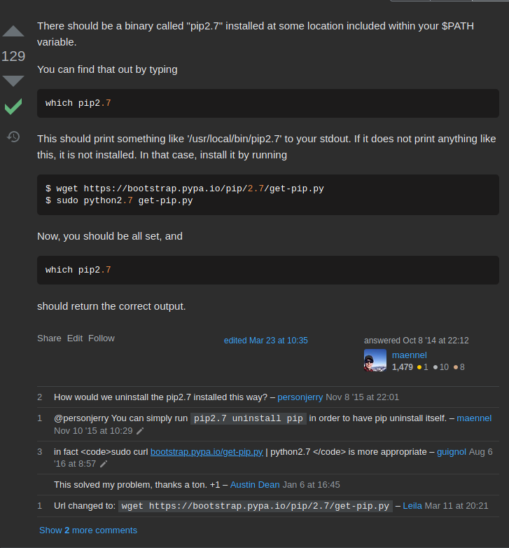

# How to install python2.7 in kali 5.10.0-kali6-amd64

In this case before getting to the issue installing [AutoBlue-MS17-010 pip2.7 install -r requirements setuptools error](autoblue-ms17-010-pip2.7-install-r-requirements-setuptools-command-errored-out-with-exit-status-1.md), I tried to install the requirements with pip3. 

This seemed to work initially, however, when running, it was not working as expected.

I found the following [stackoverflow question](https://stackoverflow.com/questions/26266437/how-to-use-python2-7-pip-instead-of-default-pip) 

